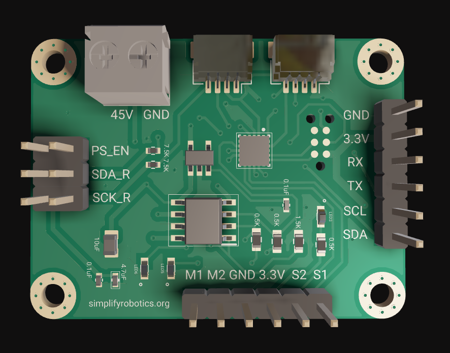

# Servo Motor Feedback Controller

  

<!-- https://github.com/user-attachments/assets/069eb083-97e3-404b-9e9d-383a1cb0ce94 -->

## PCB assembly video

The **Smart Encoder Motor Driver** is designed to control DC motors with magnetic or optical encoders. It features a built-in feedback controller and H-bridge, allowing precise motor power adjustment based on commands from a master device. Powered by the **STM32C0 microcontroller** and equipped with a **PID feedback system**, this driver ensures reliable and efficient motor control.

## Key Features
- **Built-in Feedback Controller**: High-frequency PID control for precise motor operation.
- **Trapezoidal Trajectory Planner**: Ensures smooth acceleration and deceleration by generating motion profiles for precise movement control.
- **Digital Communication**: Supports ASCII commands for setting motor target positions, tuning PID coefficients, monitoring torque feedback, and more.
- **Voltage Range**: 5V to 45V.
- **Current Capacity**: Up to 4.1 amps.
- **Communication**: Supports I2C and UART protocols.
- **Expandable Design**: Qwiic connectors allow daisy-chaining of up to 256 units on a single I2C port.

## Trapezoidal Trajectory Planner
The driver includes an **embedded trapezoidal trajectory generator**, which ensures smooth motor motion by controlling acceleration and deceleration. This feature prevents sudden jerks, reduces mechanical stress, and improves overall system stability.

### Key Benefits
- Smooth position transitions with controlled acceleration and deceleration.
- Prevents overshooting and oscillations.
- Customizable speed, acceleration, and deceleration limits.

### Motion Profile

The controller automatically computes the trajectory based on the target position, velocity, and acceleration constraints.
A custom web-based UART plotter is used for live plotting of motor motion parameters. 

The plots below display: 
1. Position
2. Velocity
3. Current drawn by the motor

## Custom Live Plotter
A custom live plotter is built for monitoring the motor speed, acceleration, and current draw.  
Check out the [Live UART Plotter](https://egeozgul.github.io/live-uart/) to visualize real-time data from your motor driver.  
It supports plotting an unlimited number of variables with customizable styling.

## Final PCB Design Iteration

The **PID feedback control system** ensures precise and stable motor control, making it suitable for robotics, automation, and other applications requiring high precision.

## Connectivity and Expansion
The motor driver is designed for scalability, using **Qwiic connectors** for easy daisy-chaining. This allows control of a large number of motors, making it ideal for projects requiring extensive motor coordination.

## License
This project is open-source under the MIT License. Feel free to modify and distribute it as needed!
