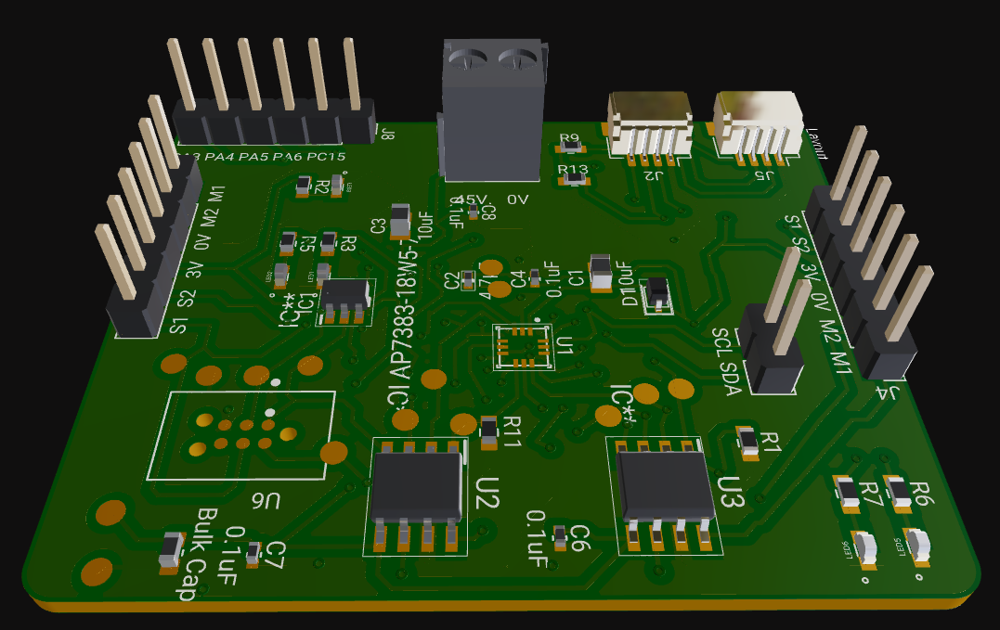

# DC Motor Driver with Built-in Feedback Controller

This is the repository of the Smart Encoder Motor Driver. This driver is built to drive DC motors with magnetic or optical encoders using a builtin feedback controller and an hbridge. This device receives digital comamnds from an additional master device and powers the motors accordingly.

Powered by the robust STM32C0 microcontroller and equipped with a precision PID feedback control system, this driver is engineered to deliver optimized performance and reliability.

Note that this github page is for presentation only, so the pcb design and sourcecode are currently not public.

## Key Features
- **Builtin Feedback Controller:** High frequency builtin pid controller.
- **Digital Communication:** Custom ascii and binary communication modes which allows updating motor target position, updating and saving pid coefficients, receiving torque feedback, and further configuring the board.
- **Voltage Compatibility:** Supports 5V to 45V.
- **Ample Current Supply:** Capable of delivering up to 4.1 amps.
- **Dual Motor Management:** Drive two motors  simultaneously.
- **Versatile Communication:** Features support for I2C, UART, SPI protocols.
- **Expandable Design:** Equipped with Qwiic connectors, our driver allows for daisy chaining up to 256 units, enabling control of up to 512 motors using single i2c port.

## Board Overview

  

  

  

At the heart of our motor driver lies a PID feedback control mechanism, meticulously integrated to ensure precise motor control and stability across a wide range of applications. Whether you're building complex robotic systems or intricate automated processes, our driver provides the control you need to achieve exceptional results

## Connectivity and Expansion

Designed with scalability in mind, our motor driver leverages Qwiic connectors for seamless daisy chaining. This innovative feature allows for the control of an expansive array of motors, making it an ideal choice for projects that require extensive coordination and control capabilities.
