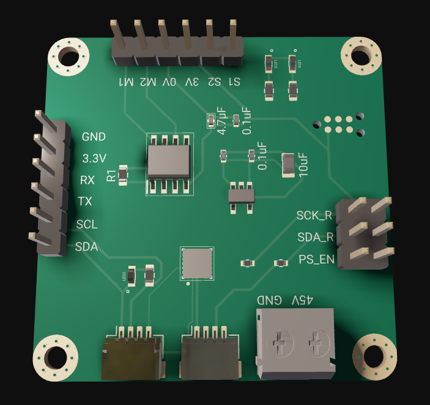
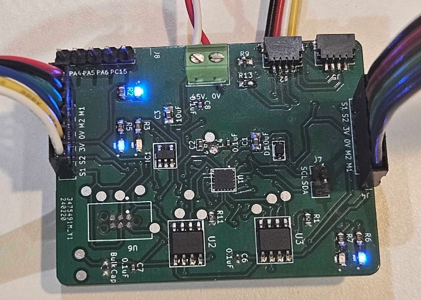
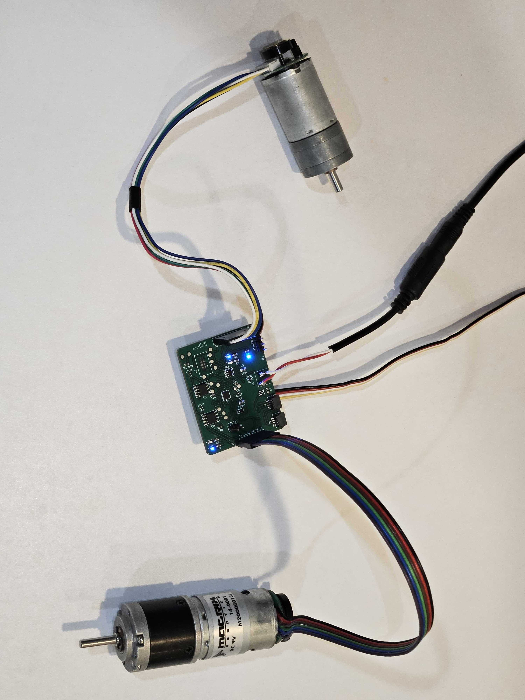

# DC Motor Driver with Built-in Feedback Controller

  

This is the Smart Encoder Motor Driver, built to control DC motors with magnetic or optical encoders. It includes a built-in feedback controller and H-bridge to adjust motor power based on commands from a master device.

Powered by the STM32C0 microcontroller and featuring a precise PID feedback system, this driver is made for reliable and efficient motor control.

Please note, this page is for presentation only. The PCB design and source code are not available at this time.

# Key Features

Built-in Feedback Controller: High-frequency PID control for precise motor operation.

Digital Communication: Supports ASCII and binary modes for setting motor target position, adjusting PID coefficients, receiving torque feedback, and other configurations.

Voltage Range: Supports 5V to 45V.

Current Capacity: Up to 4.1 amps.

Dual Motor Support: Can control two motors simultaneously.

Communication: Supports I2C and UART protocols.

Expandable Design: Qwiic connectors allow daisy-chaining of up to 256 units, supporting up to 512 motors on a single I2C port.

# Motion Plots

A custom web based uart plotter is used for live plotting motion parameters of the motor. The first plot displays the position, second plot displays the velocity, and the third plot displays the current drawn by the motor.

Check out the link below to access to my custom web based uart plotter below. It can plot (almost)infinitely many live plots on browser using usb and uart interfaces.
https://egeozgul.github.io/live-uart/

## Board Overview

  

  

The PID feedback control system ensures precise and stable motor control for a wide range of uses. Whether you're working on robotics or automation, this driver offers the precision you need for excellent results.

## Connectivity and Expansion

The motor driver is designed for scalability, using Qwiic connectors for easy daisy-chaining. This allows you to control a large number of motors, making it ideal for projects that require extensive motor coordination.

